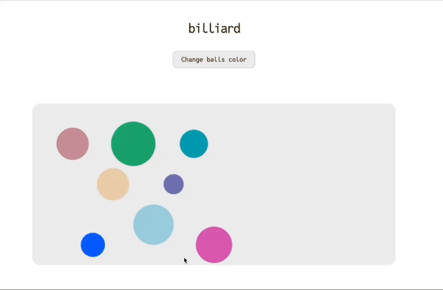

# billard на canvas
без использования сторонних библиотек отрисовки и физики.

Технологии: Canvas, TS, React.

Суть игры: 

- Есть прямоугольное поле Canvas, на котором расположены шары разного размера;
- Можно толкнуть мышкой шар в сторону;
- Шар упруго соударяется с другими шарами и стенками, часть импульса при соударении теряется;
- Можно выбрать новый цвет шара (нажать на кнопку изменения цвета, которая остановит анимацию, после чего кликнуть на нужный шарик).

Для запуска сервера: 

- cd client 
- npm run dev
